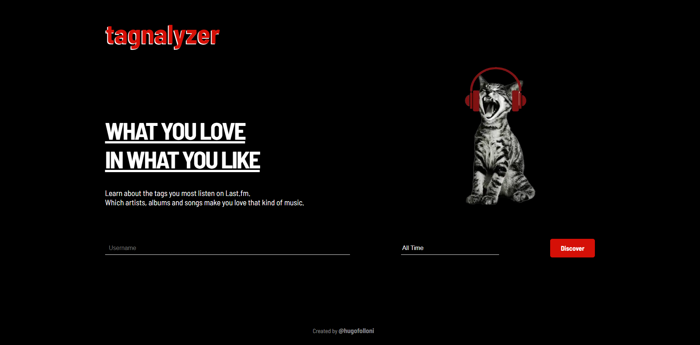

# tagnalyzer

A web application that provides Last.fm users with detailed insights into their listening habits by analyzing the tags associated with their favorite artists. Users can explore their most-listened tags and discover information about, including the most listened tracks, albums and artists in the scope of that tag.

## Motivation

The native report that Last.fm provides can be quite limited and doesn't display detailed information about the tags in tracks. This limitation makes it difficult to explore insights about genres or discover new artists based on specific tag-based trends. 

I started this project because I wanted to know which artists from a particular genre were my most listened to, but Last.fm didn't offer that functionality. Since I couldn't find the information I wanted, I decided to build a tool that could do it myself. Tagnalyzer is designed to provide users with a richer and more customizable way to analyze their music preferences based on track tags.

## Table of Contents

- [Motivation](#motivation)
- [Technologies Used](#technologies-used)
- [User Story](#user-story)
- [Features](#features)
- [Screenshots](#screenshots)
- [Getting Started](#getting-started)
- [License](#license)

## Technologies Used

- **Next.js**: A React framework for building server-side rendered applications.
- **TypeScript**: A statically typed programming language that builds on JavaScript.
- **Sass**: A CSS preprocessor that adds power and elegance to the basic language.
- **Redux**: A predictable state container for JavaScript apps.
- **Last.fm API**: Provides access to user listening data and associated tags.
- **Spotify API**: Used to retrieve images for artists, albums and songs.

## User Story

As a Last.fm user, I want to analyze the tags associated with my most-listened tracks, artists, and albums so that I can gain insights into my musical preferences.

## Features

- **User Page**: Displays the user's most-listened tags and artists, providing a personalized overview of listening habits.
- **Tag Page**: Offers detailed information about a specific tag, including the most listened artists, songs, and albums associated with an Last.fm user.

## Screenshots




## Getting Started

To set up and run the tagnalyzer application locally, follow these steps:

1. **Clone the Repository**:
   
   ```bash
   git clone https://github.com/hugofolloni/tagnalyzer.git
   cd tagnalyzer
   ```

2. **Install Dependencies**:
   
   ```bash
   npm install
   ```

3. **Run the Development Server**:
   
   ```bash
   npm run dev
   ```
   
   The application will be accessible at [http://localhost:3000](http://localhost:3000).


## License

This project is licensed under the MIT License. See the [LICENSE](LICENSE) file for more details.

